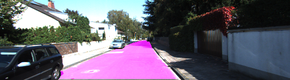

# Semantic Segmentation

Image semantic segmentation is more and more being of interest for computer vision and machine learning researchers. Many applications on the rise need accurate and efficient segmentation mechanisms: autonomous driving, indoor navigation, and even virtual or augmented reality systems to name a few. In this work, we have defined and detail the space of fully convolutional networks, explain their application to spatially dense prediction tasks, and draw connections to prior models. Adapting VGG net  into fully convolutional networks and transfer their learned representations by fine-tuning to the segmentation task by implementing [Fully Convolutional Network (FCN)](https://people.eecs.berkeley.edu/~jonlong/long_shelhamer_fcn.pdf).

The insight of that approach was to take advantage of existing CNNs as powerful visual models that are able to learn hierarchies of features. Those maps are upsampled using fractionally strided convolutions (also named deconvolutions) to produce dense per-pixel labeled outputs.

**IMPORTANT** Note that this project ask for **high-end GPUs**, I have ran out of memory using GTX960M. Please remember to control the parameter in  `gpu_options = tf.GPUOptions(per_process_gpu_memory_fraction=YOUR_PARAMETER)` in the `run` function.

Thanks for Microsoft Azure's to give me the access to use high-end Deep Learning VM(Marked as ND-Series).

#### Dataset
Download the [Kitti Road dataset](http://www.cvlibs.net/datasets/kitti/eval_road.php) from [here](http://www.cvlibs.net/download.php?file=data_road.zip).  Extract the dataset in the `data` folder.  This will create the folder `data_road` with all the training a test images.

### The output would be like

